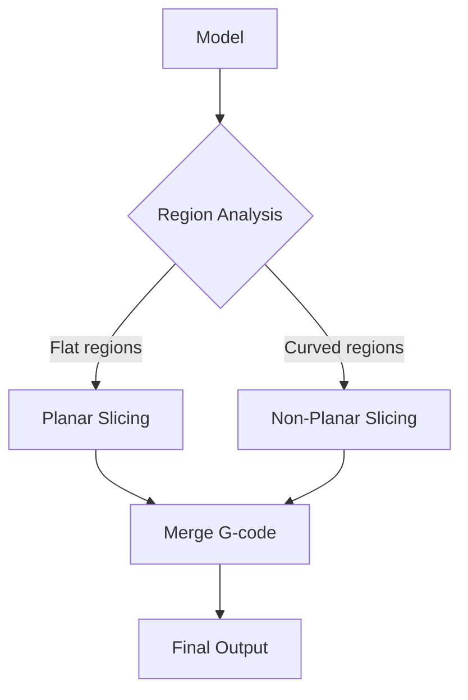

# Adaptive Slicing

Vary layer thickness based on local geometry to optimize print time and surface quality.

## Curvature-Based Layer Thickness

**Paper:** `Adaptive_Slicing_FDM_Revisited_Hamburg_2017.pdf`

### Core Formula

```
τ(p) = τ_min + (τ_max - τ_min) × f(κ(p))

where:
  τ(p) = layer thickness at point p
  κ(p) = local surface curvature
  f(κ) = mapping function
```

### Mapping Functions

```python
def linear_mapping(curvature, kappa_max):
    return 1 - min(curvature / kappa_max, 1)

def exponential_mapping(curvature, kappa_max, alpha=2):
    return np.exp(-alpha * curvature / kappa_max)

def step_mapping(curvature, thresholds):
    for i, (threshold, value) in enumerate(thresholds):
        if curvature < threshold:
            return value
    return 0
```

### Implementation

```python
def adaptive_slice(mesh, tau_min=0.1, tau_max=0.3):
    # 1. Compute curvature at each vertex
    curvatures = compute_mean_curvature(mesh)

    # 2. Build adaptive height field
    heights = [0]
    z = 0
    while z < mesh.bounds[1][2]:
        # Sample curvature at current height
        slice_curve = sample_curvature_at_height(mesh, curvatures, z)
        avg_curvature = np.mean(slice_curve)

        # Compute layer thickness
        tau = tau_min + (tau_max - tau_min) * linear_mapping(avg_curvature, 0.1)

        z += tau
        heights.append(z)

    # 3. Slice at computed heights
    layers = []
    for h in heights:
        layer = slice_at_height(mesh, h)
        layers.append(layer)

    return layers, heights
```

---

## Cusp Height Method

### Theory

The "cusp" is the scallop left between layers on angled surfaces:

```
        Layer n+1
       ─────────
      ╱         ╲
     ╱   cusp    ╲
    ╱─────────────╲
   ╱    Layer n    ╲
  ─────────────────────

h_cusp = τ × tan(θ)

where θ = surface angle from vertical
```

### Constraint

```python
def compute_max_layer_thickness(surface_angle, max_cusp_height):
    """
    Given a maximum allowable cusp height, compute layer thickness.

    h_cusp = τ × tan(θ)
    τ = h_cusp / tan(θ)
    """
    if surface_angle < 1e-6:  # Nearly vertical
        return float('inf')

    theta_rad = np.radians(surface_angle)
    return max_cusp_height / np.tan(theta_rad)
```

### Adaptive Algorithm

```python
def cusp_based_slicing(mesh, max_cusp=0.05, tau_min=0.1, tau_max=0.3):
    heights = [0]
    z = 0

    while z < mesh.max_z:
        # Find steepest surface angle at this height
        contour = slice_at_height(mesh, z)
        angles = compute_surface_angles(mesh, contour)
        max_angle = max(angles)

        # Compute thickness from cusp constraint
        tau_cusp = compute_max_layer_thickness(max_angle, max_cusp)
        tau = np.clip(tau_cusp, tau_min, tau_max)

        z += tau
        heights.append(z)

    return heights
```

---

## Optimal Triangle Mesh Slicing

**Paper:** `Optimal_Triangle_Mesh_Slicing.pdf`

### O(n log k) Algorithm

```python
def optimal_slicing(mesh, tau_min, tau_max, error_threshold):
    """
    Compute optimal slice heights in O(n log k) time.
    n = number of triangles
    k = number of layers
    """
    # 1. Sort triangles by z-extent
    triangles = sorted(mesh.triangles, key=lambda t: t.z_min)

    # 2. Event-driven sweep
    events = []
    for t in triangles:
        events.append((t.z_min, 'enter', t))
        events.append((t.z_max, 'exit', t))

    events.sort(key=lambda e: e[0])

    # 3. Compute optimal heights using DP
    heights = dynamic_programming_heights(events, tau_min, tau_max, error_threshold)

    return heights
```

### Error Metric

```python
def slicing_error(mesh, layer_heights):
    """
    Total error = sum of cusp heights across all surfaces
    """
    total_error = 0

    for i in range(len(layer_heights) - 1):
        z_low = layer_heights[i]
        z_high = layer_heights[i + 1]
        tau = z_high - z_low

        # Find triangles spanning this layer
        triangles = mesh.triangles_between(z_low, z_high)

        for tri in triangles:
            angle = surface_angle(tri)
            cusp = tau * np.tan(angle)
            total_error += cusp * tri.area

    return total_error
```

---

## Saliency-Preserving Slicing

**Paper:** `Saliency_Preserving_Slicing_Microsoft_2015.pdf`

### Visual Importance

Prioritize surface quality on visually important regions:

```python
def compute_saliency(mesh):
    """
    Saliency based on:
    - Surface curvature (high = important)
    - Viewpoint (front-facing = important)
    - Semantic regions (user-defined)
    """
    curvature_saliency = normalize(compute_curvature(mesh))
    viewpoint_saliency = compute_viewpoint_importance(mesh)
    semantic_saliency = get_user_annotations(mesh)

    return 0.5 * curvature_saliency + 0.3 * viewpoint_saliency + 0.2 * semantic_saliency
```

### Saliency-Weighted Slicing

```python
def saliency_adaptive_slice(mesh, tau_min, tau_max):
    saliency = compute_saliency(mesh)
    heights = [0]
    z = 0

    while z < mesh.max_z:
        # High saliency → thin layers
        local_saliency = sample_saliency_at_height(mesh, saliency, z)

        # Inverse mapping: high saliency = thin layer
        tau = tau_max - (tau_max - tau_min) * local_saliency

        z += tau
        heights.append(z)

    return heights
```

---

## Hybrid Approaches

### Planar + Non-Planar Combination

**Paper:** `NonPlanar_Slicer_Modeling_2024.pdf`



```python
def hybrid_slicing(mesh, curvature_threshold=0.05):
    # Segment mesh by curvature
    flat_regions = []
    curved_regions = []

    for face in mesh.faces:
        if curvature(face) < curvature_threshold:
            flat_regions.append(face)
        else:
            curved_regions.append(face)

    # Slice each region appropriately
    flat_gcode = planar_slice(flat_regions)
    curved_gcode = nonplanar_slice(curved_regions)

    # Merge with proper transitions
    return merge_gcode(flat_gcode, curved_gcode)
```

---

## Comparison

| Method | Speed | Quality | Complexity |
|--------|-------|---------|------------|
| Curvature-based | Fast | Good | Low |
| Cusp height | Fast | Optimal | Low |
| Optimal DP | Medium | Optimal | Medium |
| Saliency | Slow | Best | High |
| Hybrid | Medium | Very Good | Medium |

## Resources

- [Adaptive Slicing Paper](../papers/foundational#adaptive-slicing)
- [Algorithm Overview](/docs/algorithms/overview)
