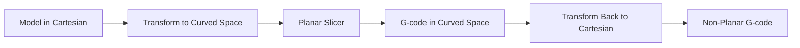
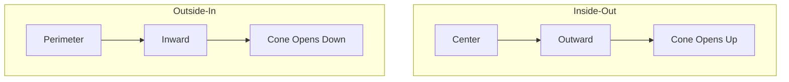

# Coordinate Transformation Methods

Map between Cartesian and curved coordinate systems to enable non-planar slicing with standard planar slicers.

## Core Concept



## Cylindrical Transformation

**Paper:** `Coupek_2018_MultiAxis_Path_Planning.pdf`

### Coordinate Mapping

```
Cartesian (x, y, z) ↔ Cylindrical (r, θ, z)

Forward Transform:
  r = √(x² + y²)
  θ = atan2(y, x)
  z = z

Inverse Transform:
  x = r·cos(θ)
  y = r·sin(θ)
  z = z
```

### Implementation

```python
import numpy as np

def cartesian_to_cylindrical(x, y, z):
    r = np.sqrt(x**2 + y**2)
    theta = np.arctan2(y, x)
    return r, theta, z

def cylindrical_to_cartesian(r, theta, z):
    x = r * np.cos(theta)
    y = r * np.sin(theta)
    return x, y, z

def transform_gcode(gcode_lines, inverse=False):
    transformed = []
    for line in gcode_lines:
        if line.startswith('G1'):
            x, y, z, e = parse_coords(line)
            if inverse:
                # r=x, theta=y in transformed space
                x_new, y_new, z_new = cylindrical_to_cartesian(x, y, z)
            else:
                r, theta, z_new = cartesian_to_cylindrical(x, y, z)
                x_new, y_new = r, theta
            transformed.append(format_gcode(x_new, y_new, z_new, e))
        else:
            transformed.append(line)
    return transformed
```

### Extrusion Compensation

Path length changes during transformation require extrusion adjustment:

```python
def compensate_extrusion(original_e, original_length, new_length):
    # Maintain constant extrusion per mm
    ratio = new_length / original_length
    return original_e * ratio
```

---

## Spherical Transformation

For dome-shaped or hemispherical parts:

```
Cartesian (x, y, z) ↔ Spherical (ρ, θ, φ)

Forward:
  ρ = √(x² + y² + z²)
  θ = atan2(y, x)           # azimuthal
  φ = acos(z / ρ)           # polar

Inverse:
  x = ρ·sin(φ)·cos(θ)
  y = ρ·sin(φ)·sin(θ)
  z = ρ·cos(φ)
```

---

## Conic Slicing

**Source:** ZHAW Research (2021)

### Two Modes



### Conic Parameters

| Mode | Cone Angle | Best For |
|------|------------|----------|
| Inside-out | 20-45° | Domes, hemispheres |
| Outside-in | 20-45° | Bowls, concave shapes |

### Implementation

```python
def conic_transform(x, y, z, cone_angle, mode='inside_out'):
    angle_rad = np.radians(cone_angle)

    if mode == 'inside_out':
        # Height increases with radius
        r = np.sqrt(x**2 + y**2)
        z_new = z + r * np.tan(angle_rad)
    else:  # outside_in
        # Height decreases with radius
        r = np.sqrt(x**2 + y**2)
        z_new = z - r * np.tan(angle_rad)

    return x, y, z_new
```

---

## Axisymmetric Non-Planar Slicing (2024)

**Paper:** `Axisymmetric_NonPlanar_Slicing_2024.pdf`

For rotationally symmetric parts with complex profiles:

### Slicing Space

```
Slicing Space {s}: (L, θ, H)
  L = arc length along generatrix curve Γ(u)
  θ = rotation angle around axis
  H = height offset from surface
```

### Transform

```
(L, θ, H) → (x, y, z)

x = (r(u) + H)·cos(θ)
y = (r(u) + H)·sin(θ)
z = z(u)

where u = u(L) requires numerical integration:
  L = ∫₀ᵘ |Γ'(t)| dt
```

### B-Spline Generatrix

```python
from scipy.interpolate import BSpline

def create_generatrix(control_points, degree=3):
    n = len(control_points)
    knots = np.linspace(0, 1, n - degree + 1)
    knots = np.concatenate([
        [0] * degree,
        knots,
        [1] * degree
    ])
    return BSpline(knots, control_points, degree)
```

---

## Workflow with Standard Slicers

### Compatible Slicers

| Slicer | Cylindrical | Spherical | Conic |
|--------|-------------|-----------|-------|
| Slic3r 1.2.9 | ✓ | ✓ | ✓ |
| CuraEngine 4.4.1 | ✓ | ✓ | ✓ |
| PrusaSlicer | Limited | Limited | ✗ |

### Pipeline

```bash
# 1. Transform model
python transform_model.py input.stl --mode cylindrical > transformed.stl

# 2. Slice with standard slicer
slic3r transformed.stl -o transformed.gcode

# 3. Transform G-code back
python transform_gcode.py transformed.gcode --inverse > final.gcode
```

## Limitations

- Works best for rotationally symmetric parts
- Extrusion compensation can be imprecise
- Some geometries produce invalid transformed meshes
- Limited overhang angle improvement

## When to Use

✓ **Good candidates:**
- Vases, bottles
- Cylinders, pipes
- Domes, hemispheres
- Rotationally symmetric parts

✗ **Poor candidates:**
- Organic shapes (use mesh deformation)
- Multi-axis parts
- Parts with sharp features
