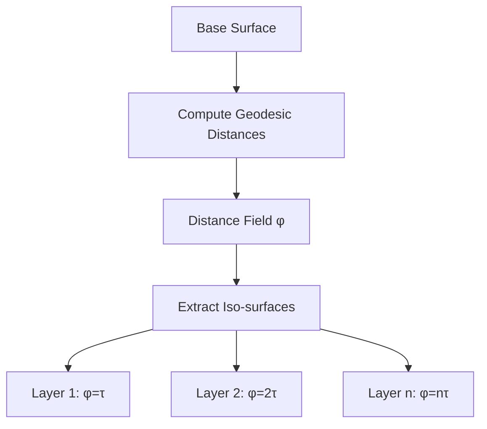

# Field-Based Slicing Methods

Use scalar or vector fields to guide layer generation, producing layers that follow the natural geometry of the part.

## Geodesic Distance Fields

**Paper:** `Geodesic_Distance_Field_Curved_Layer_2020.pdf`

### Core Concept

Layers are iso-surfaces of a geodesic distance field computed from a base surface.



### Algorithm

```python
def geodesic_slicing(mesh, base_vertices, layer_thickness):
    # 1. Compute geodesic distances using heat method
    distances = heat_method_geodesic(mesh, base_vertices)

    # 2. Extract iso-geodesic surfaces
    layers = []
    d = layer_thickness
    while d < max(distances):
        layer = extract_isosurface(mesh, distances, d)
        layers.append(layer)
        d += layer_thickness

    return layers
```

### Heat Method for Geodesics

Three-step process for fast geodesic computation:

```python
def heat_method_geodesic(mesh, sources):
    L = mesh.laplacian_matrix()  # Cotangent Laplacian
    M = mesh.mass_matrix()       # Vertex areas

    # Step 1: Solve heat equation
    # (M + t*L) u = δ_sources
    t = mesh.mean_edge_length ** 2
    u = solve((M + t * L), source_delta)

    # Step 2: Compute normalized gradient
    grad_u = mesh.gradient(u)
    X = -grad_u / np.linalg.norm(grad_u, axis=1, keepdims=True)

    # Step 3: Solve Poisson equation
    # Δφ = ∇·X
    div_X = mesh.divergence(X)
    phi = solve(L, div_X)

    # Shift so minimum is 0
    return phi - phi.min()
```

### Complexity
- **Time:** O(n log n) for heat method
- **Memory:** O(n) sparse matrices

---

## Vector Field-Based Curved Layers

### Dual Field Approach

Two orthogonal vector fields guide the slicing:

```
V_filament = Direction of material deposition
V_print = Build direction (varying across part)
```

### Scalar Field Generation

```python
def vector_field_slicing(mesh, V_print):
    # Integrate printing direction field to get height
    phi = np.zeros(len(mesh.vertices))

    # Path integral from base to each vertex
    for v in mesh.vertices:
        path = trace_path_to_base(mesh, v, V_print)
        phi[v] = integrate_along_path(path, V_print)

    return phi
```

### Field Smoothness Constraints

```
Minimize: ∫ |∇V - ∇V_target|² dΩ

Subject to:
  V aligned with stress directions
  V smooth (low curl)
  V respects boundary conditions
```

---

## Stress-Aligned Fields

**Paper:** `Reinforced_FDM_MultiAxis_SIGGRAPH_Asia_2020.pdf`

Align layers with principal stress directions for maximum strength:

```python
def stress_aligned_field(mesh, loads, constraints):
    # 1. FEM stress analysis
    stress_tensor = fem_analysis(mesh, loads, constraints)

    # 2. Extract principal directions
    for element in mesh.elements:
        σ = stress_tensor[element]
        eigenvalues, eigenvectors = np.linalg.eigh(σ)

        # Principal stress direction (max eigenvalue)
        principal_dir = eigenvectors[:, np.argmax(eigenvalues)]

    # 3. Smooth field across mesh
    field = smooth_vector_field(principal_directions)

    return field
```

### Benefits
- Layers aligned with load paths
- 2-3x strength improvement in tension
- Reduced delamination risk

---

## Iso-Surface Extraction

### Marching Cubes for Tetrahedral Meshes

```python
def extract_isosurface(tet_mesh, scalar_field, iso_value):
    triangles = []

    for tet in tet_mesh.elements:
        values = scalar_field[tet.vertices]

        # Find crossing edges
        crossings = []
        for edge in tet.edges:
            v1, v2 = edge
            if (values[v1] - iso_value) * (values[v2] - iso_value) < 0:
                # Linear interpolation
                t = (iso_value - values[v1]) / (values[v2] - values[v1])
                point = (1-t) * mesh.vertices[v1] + t * mesh.vertices[v2]
                crossings.append(point)

        # Triangulate crossings (3 or 4 points)
        if len(crossings) == 3:
            triangles.append(crossings)
        elif len(crossings) == 4:
            triangles.append([crossings[0], crossings[1], crossings[2]])
            triangles.append([crossings[0], crossings[2], crossings[3]])

    return triangles
```

---

## Applications

### Fiber Composite Printing

**Paper:** `Continuous_Fiber_Spatial_Printing_2023.pdf`

Geodesic fields excel for continuous fiber paths:

```python
def fiber_toolpath(mesh, fiber_direction_field):
    # Generate geodesic paths following fiber direction
    paths = []

    for start in seed_points:
        path = trace_geodesic(mesh, start, fiber_direction_field)
        paths.append(path)

    return paths
```

### Organic Shapes

Geodesic layers naturally conform to:
- Anatomical models
- Free-form sculptures
- Ergonomic products

---

## Comparison with Other Methods

| Aspect | Geodesic | Mesh Deformation | Coordinate |
|--------|----------|------------------|------------|
| Speed | O(n log n) | O(n³) | O(n) |
| Generality | High | High | Limited |
| Surface Quality | Excellent | Excellent | Good |
| Implementation | Medium | Complex | Simple |
| Hardware | Any | 5-axis ideal | 3-axis OK |

## Resources

- [Geodesic Distance Field Paper](../papers/core-algorithms#geodesic-distance-field)
- [Field-Based Toolpath Fiber Paper](../papers/recent-advances#fiber-toolpaths)
- [Math Foundations](/docs/resources/math-foundations)
