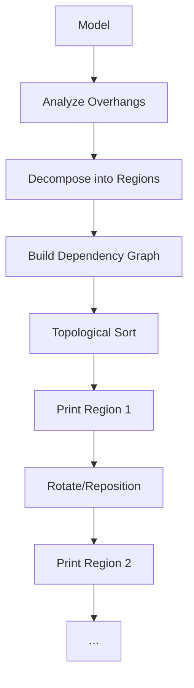
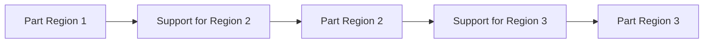

# Multi-Axis Path Planning

Leverage 5+ axis printers for full non-planar capability with collision avoidance.

## RoboFDM Decomposition

**Paper:** `RoboFDM_ICRA_2017.pdf`

### Core Concept

Decompose model into support-free regions, each with optimal print orientation.



### Algorithm

```python
def robofdm(mesh, overhang_threshold=45):
    # 1. Identify overhang faces
    overhangs = find_overhangs(mesh, overhang_threshold)

    # 2. Decompose into support-free regions
    regions = []
    remaining = mesh.copy()

    while has_overhangs(remaining):
        # Find best cut plane
        cut_plane = optimize_cut(remaining, overhangs)

        # Split mesh
        region, remaining = split_mesh(remaining, cut_plane)
        regions.append(region)

    # 3. Build dependency graph
    G = nx.DiGraph()
    for i, r1 in enumerate(regions):
        for j, r2 in enumerate(regions):
            if i != j and collides_when_printing(r2, r1):
                G.add_edge(i, j)  # r1 must print before r2

    # 4. Topological sort for print order
    order = list(nx.topological_sort(G))

    # 5. Compute optimal orientation for each region
    orientations = {}
    for idx in order:
        orientations[idx] = optimize_orientation(regions[idx])

    return regions, order, orientations
```

### Collision Detection

```python
def collides_when_printing(new_region, existing_printed):
    # Swept volume of toolhead during printing
    toolhead_path = generate_toolpath(new_region)

    for point in toolhead_path:
        toolhead_volume = toolhead_geometry_at(point)
        if intersects(toolhead_volume, existing_printed):
            return True

    return False
```

---

## Open5x Conformal Slicing

**Paper:** `Open5x_Conformal_Slicing_2022.pdf`

### 5-Axis Kinematics

```
Machine axes: X, Y, Z (linear) + U, V (rotary)

Toolhead pose: (x, y, z, u, v)
  u = rotation around X-axis
  v = rotation around Y-axis
```

### Feed Rate Compensation

**Problem:** Constant G-code feedrate ≠ constant nozzle tip speed when axes rotate.

```python
def compensate_feedrate(segment, nominal_feed):
    # Axis moves
    dx, dy, dz = segment.linear_delta
    du, dv = segment.rotary_delta  # in degrees

    # Total axis distance (treating degrees as mm-equivalent)
    axis_distance = np.sqrt(dx**2 + dy**2 + dz**2 + du**2 + dv**2)

    # Actual toolpath length at nozzle tip
    tip_path_length = compute_tip_arc_length(segment)

    # Compensation ratio
    ratio = axis_distance / tip_path_length

    # Adjusted feedrate
    return nominal_feed * ratio
```

### Inverse Kinematics

```python
def inverse_kinematics_5axis(tip_position, tip_direction):
    x, y, z = tip_position
    nx, ny, nz = tip_direction  # normalized

    # Compute rotary angles from direction vector
    # Assuming ZYX Euler convention
    v = np.arctan2(nx, nz)  # rotation around Y
    u = np.arctan2(-ny, np.sqrt(nx**2 + nz**2))  # rotation around X

    # Adjust linear position for tool offset
    tool_length = 50  # mm
    x_adj = x - tool_length * nx
    y_adj = y - tool_length * ny
    z_adj = z - tool_length * nz

    return x_adj, y_adj, z_adj, np.degrees(u), np.degrees(v)
```

---

## Singularity Avoidance

**Paper:** `Singularity_Aware_Motion_Planning_2021.pdf`

### Singularity Types

| Type | Description | Mitigation |
|------|-------------|------------|
| Gimbal Lock | Two rotary axes align | Path replanning |
| Workspace Boundary | Reach limit | Reposition workpiece |
| Wrist Singularity | Tool axis through wrist | Smooth blending |

### Detection

```python
def check_singularity(joint_angles, threshold=0.01):
    # Compute Jacobian matrix
    J = compute_jacobian(joint_angles)

    # Check condition number
    cond = np.linalg.cond(J)

    if cond > 1/threshold:
        return True, "Near singular configuration"

    # Check specific singularities
    if abs(joint_angles['wrist']) < threshold:
        return True, "Wrist singularity"

    return False, None
```

### Path Smoothing

```python
def smooth_through_singularity(path, singularity_index):
    # Blend path around singularity
    window = 10  # points before/after

    start = max(0, singularity_index - window)
    end = min(len(path), singularity_index + window)

    # Use B-spline interpolation
    smooth_segment = bspline_fit(path[start:end], degree=3)

    # Replace singular segment
    path[start:end] = smooth_segment

    return path
```

---

## Support Generation for Multi-Axis

**Paper:** `Support_Generation_Curved_Layers_2023.pdf`

### Skeleton-Based Supports

```python
def generate_curved_supports(mesh, overhang_regions):
    supports = []

    for region in overhang_regions:
        # Compute medial axis skeleton
        skeleton = compute_skeleton(region)

        # Implicit support surface
        def support_sdf(p):
            d = distance_to_skeleton(p, skeleton)
            return d - support_radius

        # March to generate support mesh
        support_mesh = marching_cubes(support_sdf, region.bounds)
        supports.append(support_mesh)

    return supports
```

### Support-Print Coordination



---

## Hardware Configurations

### Tilting Head

```
           ╔═══╗
           ║ U ║ ← Tilt axis
           ╚═╤═╝
             │
        ╔════╧════╗
        ║ Extruder ║
        ╚════╤════╝
             ▼
         [Nozzle]
```

### Tilting Bed

```
    [Fixed Head]
         │
         ▼
    ┌─────────┐
    │   Part  │ ← On tilting platform
    └────┬────┘
         │
      ╔══╧══╗
      ║ U/V ║ ← Tilt axes
      ╚═════╝
```

### Robotic Arm

```
    [Robot Base]
         │
    ┌────┴────┐
    │ Joint 1 │
    └────┬────┘
         :
    (6 joints)
         :
    ┌────┴────┐
    │Extruder │
    └─────────┘
```

---

## G-code Extensions

### 5-Axis Commands

```gcode
; Standard 3-axis
G1 X50 Y50 Z10.5 F3000 E1.5

; 5-axis with rotary
G1 X50 Y50 Z10.5 U15.2 V-8.7 F3000 E1.5

; With feed compensation
G1 X50 Y50 Z10.5 U15.2 V-8.7 F2850 E1.5  ; F adjusted
```

### Firmware Support

| Firmware | 5-Axis Support |
|----------|----------------|
| RepRapFirmware | M669 K10 mode |
| Klipper | Community plugins |
| Marlin | Limited (2.1+) |
| LinuxCNC | Full support |

## Resources

- [Open5x Implementation](/docs/implementations/slicer6d)
- [Hardware Requirements](/docs/getting-started/hardware)
