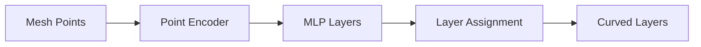

# Neural Network Approaches

Machine learning methods for non-planar slicing and path planning.

## Neural Slicer

**Paper:** `Neural_Slicer_MultiAxis_2024.pdf`

### Architecture



### Network Design

```python
import torch
import torch.nn as nn

class NeuralSlicer(nn.Module):
    def __init__(self, input_dim=3, hidden_dim=256, num_layers=8):
        super().__init__()

        layers = []
        layers.append(nn.Linear(input_dim, hidden_dim))
        layers.append(nn.ReLU())

        for _ in range(num_layers - 2):
            layers.append(nn.Linear(hidden_dim, hidden_dim))
            layers.append(nn.ReLU())
            layers.append(nn.LayerNorm(hidden_dim))

        # Output: layer height assignment
        layers.append(nn.Linear(hidden_dim, 1))

        self.network = nn.Sequential(*layers)

    def forward(self, points):
        """
        Input: points (N, 3) - xyz coordinates
        Output: heights (N, 1) - layer assignment
        """
        return self.network(points)
```

### Training

```python
def train_neural_slicer(model, mesh, epochs=1000):
    optimizer = torch.optim.Adam(model.parameters(), lr=1e-3)

    for epoch in range(epochs):
        # Sample points from mesh
        points = sample_mesh_points(mesh, n=10000)

        # Forward pass
        heights = model(points)

        # Loss: combination of objectives
        loss = (
            overhang_loss(heights, mesh) +
            smoothness_loss(heights) +
            thickness_loss(heights)
        )

        optimizer.zero_grad()
        loss.backward()
        optimizer.step()

def overhang_loss(heights, mesh):
    """Penalize overhangs exceeding threshold"""
    gradients = compute_height_gradients(heights, mesh)
    angles = torch.atan(gradients)
    overhangs = torch.relu(angles - max_overhang_angle)
    return overhangs.mean()

def smoothness_loss(heights):
    """Encourage smooth layer transitions"""
    laplacian = compute_laplacian(heights)
    return laplacian.pow(2).mean()
```

---

## Implicit Neural Fields

**Paper:** `Implicit_Neural_Field_MultiAxis_2024.pdf`

### Neural SDF Representation

```python
class ImplicitNeuralField(nn.Module):
    def __init__(self):
        super().__init__()
        self.sdf_net = SIREN(in_features=3, out_features=1)
        self.dir_net = SIREN(in_features=3, out_features=3)

    def forward(self, points):
        """
        Returns:
          sdf: signed distance to surface
          direction: local printing direction
        """
        sdf = self.sdf_net(points)
        direction = self.dir_net(points)
        direction = direction / direction.norm(dim=-1, keepdim=True)
        return sdf, direction
```

### SIREN Activation

```python
class SIRENLayer(nn.Module):
    """Sinusoidal activation for implicit neural representations"""
    def __init__(self, in_features, out_features, omega_0=30):
        super().__init__()
        self.omega_0 = omega_0
        self.linear = nn.Linear(in_features, out_features)

        # Special initialization
        with torch.no_grad():
            self.linear.weight.uniform_(-np.sqrt(6/in_features) / omega_0,
                                         np.sqrt(6/in_features) / omega_0)

    def forward(self, x):
        return torch.sin(self.omega_0 * self.linear(x))
```

---

## INF-3DP: Collision-Free Multi-Axis

**Paper:** `INF_3DP_Collision_Free_2024.pdf`

### Collision-Aware Neural Field

```python
class CollisionAwareField(nn.Module):
    def __init__(self):
        super().__init__()
        self.layer_field = ImplicitNeuralField()
        self.collision_net = nn.Sequential(
            nn.Linear(6, 256),  # point + direction
            nn.ReLU(),
            nn.Linear(256, 256),
            nn.ReLU(),
            nn.Linear(256, 1),
            nn.Sigmoid()  # collision probability
        )

    def forward(self, points, toolhead_pose):
        layer_height, print_dir = self.layer_field(points)

        # Check collision probability
        collision_input = torch.cat([points, toolhead_pose], dim=-1)
        collision_prob = self.collision_net(collision_input)

        return layer_height, print_dir, collision_prob
```

### Training with Collision Avoidance

```python
def collision_loss(model, points, printed_region):
    """Penalize paths that collide with printed geometry"""
    _, directions, _ = model(points, current_pose)

    # Simulate toolhead path
    toolhead_positions = simulate_toolhead(points, directions)

    # Check intersections with printed region
    collisions = check_intersections(toolhead_positions, printed_region)

    return collisions.float().mean()
```

---

## Graph Neural Networks for Toolpath

**Paper:** `Learning_Based_Toolpath_Planner_2024.pdf`

### Mesh as Graph

```python
import torch_geometric as pyg

def mesh_to_graph(mesh):
    """Convert mesh to graph for GNN processing"""
    # Nodes: vertices
    x = torch.tensor(mesh.vertices, dtype=torch.float)

    # Edges: mesh edges
    edges = mesh.edges.T
    edge_index = torch.tensor(edges, dtype=torch.long)

    # Node features: position + normal
    normals = torch.tensor(mesh.vertex_normals, dtype=torch.float)
    node_features = torch.cat([x, normals], dim=-1)

    return pyg.data.Data(x=node_features, edge_index=edge_index)
```

### GNN Architecture

```python
from torch_geometric.nn import GCNConv, global_mean_pool

class ToolpathGNN(nn.Module):
    def __init__(self, input_dim=6, hidden_dim=128):
        super().__init__()
        self.conv1 = GCNConv(input_dim, hidden_dim)
        self.conv2 = GCNConv(hidden_dim, hidden_dim)
        self.conv3 = GCNConv(hidden_dim, hidden_dim)

        # Output: print order + layer assignment
        self.order_head = nn.Linear(hidden_dim, 1)
        self.layer_head = nn.Linear(hidden_dim, 1)

    def forward(self, data):
        x, edge_index = data.x, data.edge_index

        x = F.relu(self.conv1(x, edge_index))
        x = F.relu(self.conv2(x, edge_index))
        x = F.relu(self.conv3(x, edge_index))

        order = self.order_head(x)
        layer = self.layer_head(x)

        return order, layer
```

---

## Training Data Generation

### Synthetic Dataset

```python
def generate_training_data(n_samples=10000):
    data = []

    for _ in range(n_samples):
        # Random mesh (primitives or procedural)
        mesh = generate_random_mesh()

        # Ground truth from traditional algorithm
        layers_gt = curvislice(mesh)  # or S³-Slicer

        data.append({
            'mesh': mesh,
            'layers': layers_gt,
            'overhang_angles': compute_overhangs(mesh, layers_gt)
        })

    return data
```

### Data Augmentation

```python
def augment_mesh(mesh):
    # Random rotation
    R = random_rotation_matrix()
    mesh.vertices = mesh.vertices @ R.T

    # Random scaling
    s = np.random.uniform(0.5, 2.0)
    mesh.vertices *= s

    # Random noise
    noise = np.random.normal(0, 0.01, mesh.vertices.shape)
    mesh.vertices += noise

    return mesh
```

---

## Performance Comparison

| Method | Training Time | Inference | Quality |
|--------|---------------|-----------|---------|
| Neural Slicer | 2-4 hours | 100ms | Good |
| INF-3DP | 4-8 hours | 200ms | Excellent |
| GNN Toolpath | 1-2 hours | 50ms | Good |
| CurviSlicer | N/A | 45 min | Excellent |
| QuickCurve | N/A | 30 sec | Good |

### When to Use Neural Methods

✓ **Good for:**
- Real-time/interactive slicing
- Similar geometries (trained domain)
- Approximate solutions acceptable

✗ **Avoid for:**
- New geometry types
- Precision requirements
- Limited training data

## Resources

- [Neural Slicer Paper](../papers/recent-advances#neural-slicer-2024)
- [INF-3DP Paper](../papers/recent-advances#inf-3dp-collision-free-neural-fields-2024)
- [Algorithm Overview](/docs/algorithms/overview)
