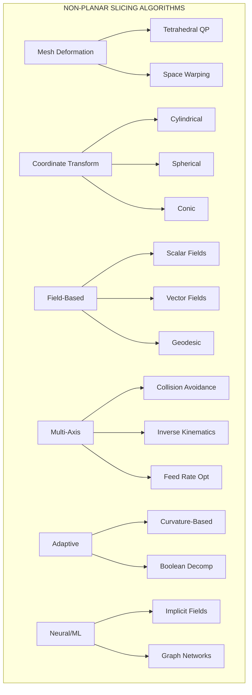
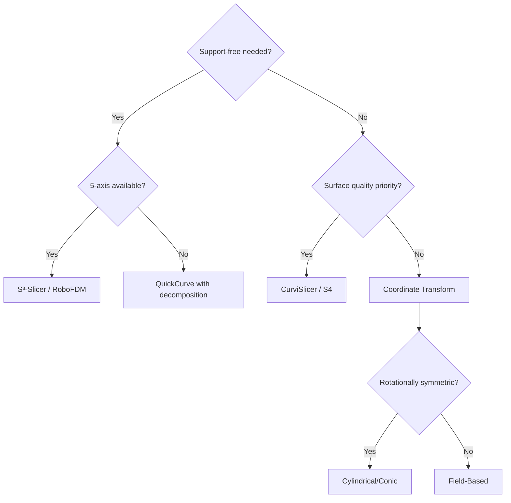

# Non-Planar Slicing Algorithms

A comprehensive taxonomy of approaches to curved layer 3D printing.

## Algorithm Categories



## Comparison Matrix

| Algorithm | Complexity | Hardware | Best For |
|-----------|------------|----------|----------|
| CurviSlicer | O(n³) | 3-axis | Surface quality |
| S³-Slicer | O(n³) | 5-axis | Multi-objective |
| QuickCurve | O(n) | 3-axis | Fast iteration |
| Geodesic Field | O(n log n) | Any | Organic shapes |
| RoboFDM | O(n²) | 6-axis | Support-free |
| Open5x | O(n) | 5-axis | Production |
| Neural Slicer | O(n) | Any | Complex geometry |

## Key Trade-offs

### Speed vs. Quality
```
QuickCurve ────────────────────── CurviSlicer
(Fast, approximate)              (Slow, optimal)
```

### Flexibility vs. Complexity
```
FullControl ───────────────────── PrusaSlicer Fork
(Total control, manual)          (Automated, limited)
```

### Hardware Requirements
```
3-axis ──── 5-axis ──── 6-axis robotic
(Limited)   (Research)  (Full capability)
```

## Decision Flowchart



## Mathematical Foundations

All approaches rely on core concepts:

### 1. Deformation Gradient
```
F = ∂x/∂X

Where:
  x = deformed position
  X = original position
  F = 3×3 Jacobian matrix
```

### 2. Layer Height Constraint
```
τ_min ≤ τ(p) ≤ τ_max

Where:
  τ(p) = local layer thickness
  Typically: 0.1mm ≤ τ ≤ 0.4mm
```

### 3. Overhang Angle
```
θ = arccos(n · z)

Where:
  n = surface normal
  z = build direction (0,0,1)
  Constraint: θ ≤ θ_max (typically 45°)
```

## Deep Dives

Explore each category in detail:

- [Mesh Deformation](/docs/algorithms/mesh-deformation) - CurviSlicer, S³, QuickCurve
- [Coordinate Transform](/docs/algorithms/coordinate-transform) - Cylindrical, spherical, conic
- [Field-Based](/docs/algorithms/field-based) - Geodesics, vector fields
- [Multi-Axis](/docs/algorithms/multi-axis) - RoboFDM, Open5x, collision
- [Adaptive Slicing](/docs/algorithms/adaptive-slicing) - Curvature-based layers
- [Neural Methods](/docs/algorithms/neural-methods) - ML approaches
