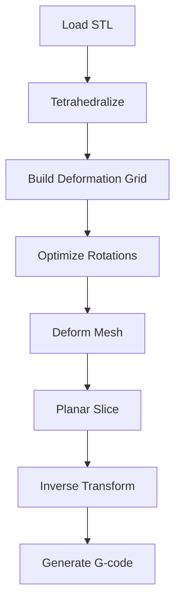

# Quick Start Guide

Get non-planar slicing working in 5 minutes with S4 Slicer.

## Option 1: Google Colab (No Install)

The fastest way to try non-planar slicing:

1. Open [S4 Slicer on Colab](https://colab.research.google.com/)
2. Upload `S4_Slicer/main.ipynb` from this repository
3. Run all cells
4. Download generated G-code

## Option 2: Local Jupyter

```bash
cd slicerresearch/S4_Slicer

# Install dependencies
pip install -r requirements.txt

# Launch notebook
jupyter notebook main.ipynb
```

### Notebook Workflow



## Option 3: FullControl (Direct G-code)

For complete control over every path segment:

```python
import fullcontrol as fc

# Define non-planar path
steps = []
for z in range(0, 50, 1):
    angle = z * 0.1
    x = 50 + 20 * np.cos(angle)
    y = 50 + 20 * np.sin(angle)
    steps.append(fc.Point(x=x, y=y, z=z))

# Generate G-code
fc.transform(steps, 'gcode', fc.GcodeControls(
    printer_name='generic',
    save_as='spiral.gcode'
))
```

## Verify Output

Check your G-code has non-planar moves:

```gcode
; Traditional (planar)
G1 X50 Y50 Z10.2 E100
G1 X60 Y50 Z10.2 E101  ; Z constant

; Non-planar
G1 X50 Y50 Z10.2 E100
G1 X60 Y50 Z10.8 E101  ; Z varies within layer
```

## Sample Models

Good models for first tests:

| Model | Why It Works |
|-------|-------------|
| Stanford Bunny | Smooth organic curves |
| Hemisphere | Clear surface quality improvement |
| Vase | Rotationally symmetric |

Avoid:
- Sharp internal corners
- Sub-mm thin walls
- Overhangs > 60°

## Next Steps

- [Hardware Requirements](/docs/getting-started/hardware) - Before printing
- [S4 Slicer Deep Dive](/docs/implementations/s4-slicer) - Full algorithm details
- [Algorithm Overview](/docs/algorithms/overview) - Theory behind it all
