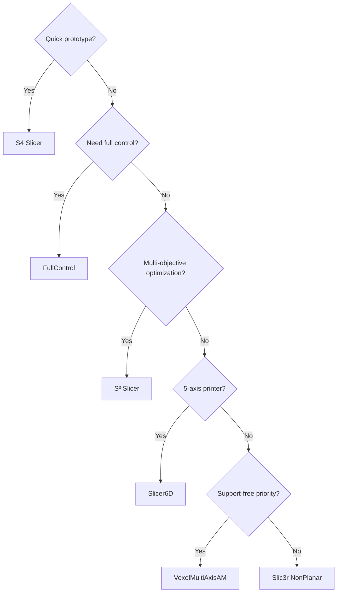

# Open Source Implementations

This repository contains six cloned implementations of non-planar slicing algorithms.

## Quick Comparison

| Project | Algorithm | Language | Status | Best For |
|---------|-----------|----------|--------|----------|
| [S4 Slicer](/docs/implementations/s4-slicer) | Mesh deformation | Python/Jupyter | Active | Quick experiments |
| [S³ Slicer](/docs/implementations/s3-slicer) | Multi-objective | C++ | Research | Full capability |
| [FullControl](/docs/implementations/fullcontrol) | Direct G-code | Python | Active | Total control |
| [Slicer6D](/docs/implementations/slicer6d) | 5-axis | Python | Reference | Multi-axis |
| VoxelMultiAxisAM | Decomposition | C++ | Archive | Support-free |
| Slic3r NonPlanar | Top finishing | C++ | Historical | 3-axis |

## Repository Structure

```
slicerresearch/
├── S4_Slicer/           # Jupyter notebook slicer
│   ├── main.ipynb
│   └── requirements.txt
├── S3_DeformFDM/        # C++ multi-objective
│   ├── CMakeLists.txt
│   └── src/
├── fullcontrol/         # Python G-code designer
│   ├── fullcontrol/
│   └── examples/
├── Slicer6D/            # 5-axis reference
│   ├── slicer/
│   └── examples/
├── VoxelMultiAxisAM/    # Support-free decomposition
│   ├── CMakeLists.txt
│   └── src/
└── Slic3r_NonPlanar_Slicing/  # Historical fork
    └── src/
```

## Decision Guide



## Setup Requirements

### Python Projects (S4, FullControl, Slicer6D)

```bash
# Python 3.10+
pip install numpy scipy pyvista trimesh matplotlib jupyter
```

### C++ Projects (S³, VoxelMultiAxis)

| Dependency | Purpose |
|------------|---------|
| CMake 3.16+ | Build system |
| Eigen3 | Linear algebra |
| libigl | Geometry processing |
| TetGen | Tetrahedralization |
| CGAL | Computational geometry |

```bash
# Ubuntu/Debian
sudo apt install cmake libeigen3-dev libcgal-dev

# macOS
brew install cmake eigen cgal
```

## Getting Started

1. **Beginners:** Start with [S4 Slicer](/docs/implementations/s4-slicer)
2. **Researchers:** Try [S³ Slicer](/docs/implementations/s3-slicer)
3. **Makers:** Explore [FullControl](/docs/implementations/fullcontrol)
