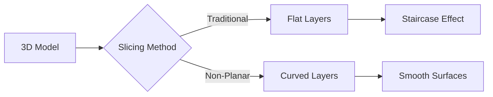

# Non-Planar 3D Printing Slicing Research

Welcome to the comprehensive research collection on **non-planar** and **curved layer** 3D printing algorithms.

## What is Non-Planar Slicing?

Traditional FDM 3D printing deposits material in flat, horizontal layers. **Non-planar slicing** breaks this limitation by allowing curved, tilted, or conformal layer paths that follow the geometry of the part.

## Key Benefits

| Benefit | Description |
|---------|-------------|
| **Surface Quality** | Eliminates staircase effect on curved surfaces |
| **Strength** | Layers can align with stress directions |
| **Support-Free** | Reorient layers to avoid overhangs |
| **Efficiency** | Fewer layers for smooth geometries |

## Algorithm Categories

This research covers six major algorithmic approaches:

### 1. Mesh Deformation
Transform the model so planar slicing produces curved paths when inverse-mapped.
- **CurviSlicer** - QP optimization with tetrahedral meshes
- **S³-Slicer** - Multi-objective quaternion optimization
- **QuickCurve** - Simplified least-squares approach

### 2. Coordinate Transformation
Map between Cartesian and curved coordinate systems.
- Cylindrical slicing
- Spherical slicing
- Conic slicing

### 3. Field-Based Methods
Use scalar or vector fields to guide layer generation.
- Geodesic distance fields
- Heat method
- Vector field alignment

### 4. Multi-Axis Path Planning
Leverage 5+ axis printers for collision-free non-planar paths.
- RoboFDM decomposition
- Open5x kinematics
- Singularity avoidance

### 5. Adaptive Slicing
Vary layer thickness based on geometry.
- Curvature-based adaptation
- Cusp height optimization

### 6. Neural/ML Methods
Machine learning approaches to layer generation.
- Neural Slicer
- Implicit neural fields
- Graph neural networks

## Repository Contents

This repository contains:

- **40+ Research Papers** (~320MB) - PDFs with reading order
- **6 Implementations** - Cloned open-source projects
- **Algorithm Reference** - Pseudocode and mathematical foundations
- **Project Survey** - Comparison of available tools

## Getting Started

Ready to dive in? Start with:

1. [Prerequisites](/docs/getting-started/prerequisites) - What you need
2. [Quick Start](/docs/getting-started/quick-start) - Try S4 Slicer in 5 minutes
3. [Hardware Requirements](/docs/getting-started/hardware) - Printer compatibility

Or explore the [Algorithm Overview](/docs/algorithms/overview) for the theory.
