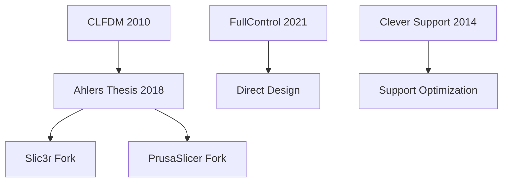

# Foundational Papers

The essential papers that established non-planar 3D printing research.

## CLFDM - Curved Layer FDM (2010)

**File:** `CLFDM_Singamneni_2010.pdf`
**Authors:** Singamneni et al.
**Size:** 288KB

The original paper introducing curved layer FDM concepts.

### Key Contributions
- First formal treatment of non-planar deposition
- Mathematical framework for curved paths
- Experimental validation on simple geometries

### Core Concept
```
Traditional: Layers ⊥ build direction
CLFDM: Layers follow surface contours
```

### Limitations Identified
- Limited to simple geometries
- Manual path planning required
- No automated slicing algorithm

---

## Ahlers Master's Thesis (2018)

**File:** `Ahlers_2018_MSc_Thesis_NonPlanar_Layers.pdf`
**Author:** Daniel Ahlers (TAMS Hamburg)
**Size:** 6.8MB

Comprehensive treatment of non-planar printing with practical implementation.

### Contents
1. Literature review of prior work
2. Mathematical foundations
3. Implementation in Slic3r
4. Hardware modifications
5. Experimental results

### Key Innovations
- Integration with existing slicer (Slic3r)
- Practical collision avoidance
- Nozzle geometry considerations

### Impact
- Basis for Slic3r non-planar fork
- Influenced PrusaSlicer fork development
- Standard reference for 3-axis non-planar

---

## FullControl G-Code Designer (2021)

**File:** `Gleadall_2021_FullControl_GCode_Designer.pdf`
**Author:** Andrew Gleadall
**Size:** 2.3MB
**Journal:** Additive Manufacturing

A paradigm shift from slicing to direct G-code design.

### Philosophy
> "Design the manufacturing process, not just the geometry."

### Key Concepts
```
Traditional Pipeline:
  CAD → STL → Slicer → G-code

FullControl Pipeline:
  Design Parameters → Script → G-code
```

### Advantages
| Aspect | Traditional | FullControl |
|--------|-------------|-------------|
| Flexibility | Constrained by slicer | Unlimited |
| Reproducibility | Manual settings | Parametric |
| File size | ~10MB G-code | ~1KB params |
| Non-planar | Limited | Native |

### Example Applications
- Helical structures
- Variable extrusion paths
- Custom infill patterns
- Multi-material coordination

---

## Clever Support (SGP 2014)

**File:** `Clever_Support_SGP_2014.pdf`
**Venue:** Symposium on Geometry Processing
**Size:** 334KB

Tree-based support structure optimization.

### Algorithm
```python
def generate_clever_support(mesh, overhang_threshold):
    # 1. Identify overhang points
    overhang_points = find_overhangs(mesh, overhang_threshold)

    # 2. Build minimum spanning tree
    mst = minimum_spanning_tree(overhang_points, mesh.base)

    # 3. Optimize branch angles
    for branch in mst.branches:
        branch.angle = optimize_angle(branch, constraints)

    return mst
```

### Benefits
- 30-50% material reduction vs. standard supports
- Self-supporting branches
- Easier removal

---

## Colloquium Presentation

**File:** `Ahlers_Colloquium_Presentation.pdf`
**Size:** 6.9MB

Thesis defense slides providing visual overview of Ahlers' work.

### Useful For
- Quick overview of non-planar concepts
- Visual examples of results
- Hardware modification photos

---

## Reading Order



1. **Start with CLFDM** - Understand the original concept
2. **Read Ahlers Thesis** - Comprehensive implementation details
3. **Study FullControl** - Alternative paradigm
4. **Review Clever Support** - Support structure optimization

## Next Steps

- [Core Algorithm Papers](/docs/papers/core-algorithms) - Modern implementations
- [Recent Advances](/docs/papers/recent-advances) - Latest research
- [Algorithm Overview](/docs/algorithms/overview) - Technical details
