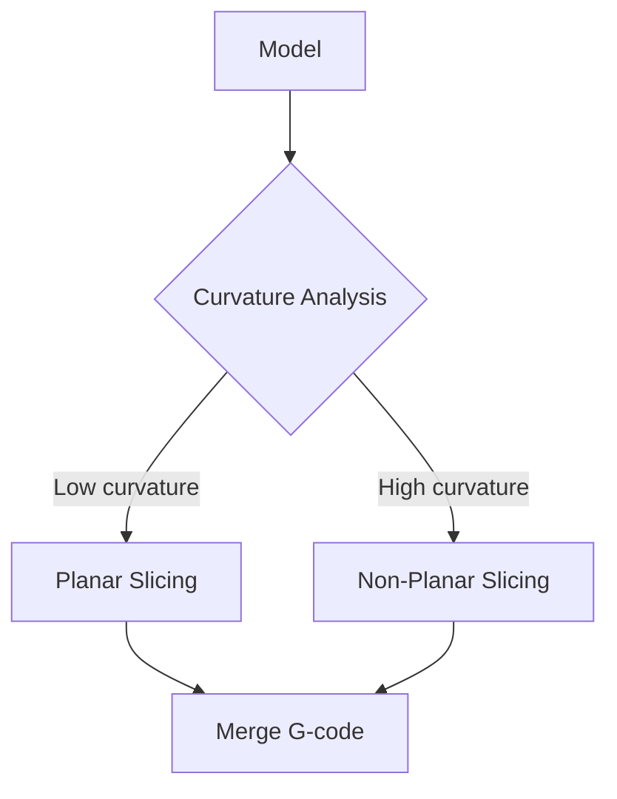

# Recent Advances (2023-2024)

The latest research in non-planar slicing, including neural network approaches.

## Neural Slicer (2024)

**File:** `Neural_Slicer_MultiAxis_2024.pdf`
**Size:** 31MB

Neural network for layer generation in multi-axis printing.

### Architecture
```
Input: Mesh vertices (N × 3)
  ↓
Point Encoder (shared MLP)
  ↓
Layer Assignment Network
  ↓
Output: Layer heights (N × 1)
```

### Training Objectives
```python
loss = (
    overhang_loss(heights, mesh) +      # Minimize overhangs
    smoothness_loss(heights) +           # Smooth transitions
    thickness_loss(heights) +            # Valid layer thickness
    collision_loss(heights, toolhead)    # Avoid collisions
)
```

### Performance
- **Inference:** ~100ms per model
- **Quality:** Comparable to CurviSlicer
- **Training:** 2-4 hours on GPU

---

## INF-3DP: Collision-Free Neural Fields (2024)

**File:** `INF_3DP_Collision_Free_2024.pdf`
**Size:** 45MB

Implicit neural fields for collision-free multi-axis paths.

### Key Innovation
Neural signed distance function (SDF) represents both:
- Part geometry
- Printing direction field

```python
class INF3DP(nn.Module):
    def forward(self, points):
        sdf = self.geometry_net(points)      # Signed distance
        direction = self.direction_net(points)  # Print direction
        collision = self.collision_net(points, direction)
        return sdf, direction, collision
```

### Collision Awareness
```python
def collision_loss(model, points, printed_volume):
    _, directions, _ = model(points)
    toolhead_path = simulate_toolhead(points, directions)
    collisions = intersect(toolhead_path, printed_volume)
    return collisions.mean()
```

---

## Learning-Based Toolpath Planner (2024)

**File:** `Learning_Based_Toolpath_Planner_2024.pdf`
**Size:** 44MB

Graph neural network for toolpath optimization.

### Mesh as Graph
```python
def mesh_to_graph(mesh):
    nodes = mesh.vertices          # Node features
    edges = mesh.edges             # Connectivity
    node_features = concat(
        mesh.vertices,
        mesh.vertex_normals,
        mesh.curvatures
    )
    return Graph(nodes, edges, node_features)
```

### GNN Architecture
```python
class ToolpathGNN(nn.Module):
    def __init__(self):
        self.conv1 = GCNConv(9, 128)   # position + normal + curvature
        self.conv2 = GCNConv(128, 128)
        self.conv3 = GCNConv(128, 128)
        self.order_head = Linear(128, 1)   # Print order
        self.layer_head = Linear(128, 1)   # Layer assignment
```

---

## Implicit Neural Field MultiAxis (2024)

**File:** `Implicit_Neural_Field_MultiAxis_2024.pdf`
**Size:** 23MB

Process planning using implicit neural representations.

### SIREN Networks
```python
class SIRENLayer(nn.Module):
    def __init__(self, in_features, out_features, omega_0=30):
        self.omega_0 = omega_0
        self.linear = Linear(in_features, out_features)

    def forward(self, x):
        return sin(self.omega_0 * self.linear(x))
```

### Advantages
- Continuous representation
- Resolution-independent
- Compact model size

---

## Fiber Composite Printing (2023-2024)

### Continuous Fiber Spatial Printing (2023)

**File:** `Continuous_Fiber_Spatial_Printing_2023.pdf`
**Size:** 5.7MB

Geodesic toolpaths for continuous fiber deposition.

```python
def fiber_path(mesh, start, direction_field):
    path = [start]
    current = start

    while not reached_boundary(current, mesh):
        direction = direction_field.sample(current)
        next_point = geodesic_step(current, direction, mesh)
        path.append(next_point)
        current = next_point

    return path
```

### Field-Based Toolpath Fiber (2021)

**File:** `Field_Based_Toolpath_Fiber_2021.pdf`
**Size:** 10.4MB

Stress-aligned continuous fiber paths.

### Toolpath Generation Fiber Stresses (2024)

**File:** `Toolpath_Gen_Fiber_Stresses_2024.pdf`
**Size:** 12.9MB

High-density fiber toolpaths via principal stress directions.

---

## Support Generation for Curved Layers (2023)

**File:** `Support_Generation_Curved_Layers_2023.pdf`
**Size:** 5.1MB

Skeleton-based supports for non-planar printing.

### Algorithm
```python
def generate_curved_support(overhang_region):
    # Compute medial axis skeleton
    skeleton = compute_skeleton(overhang_region)

    # Implicit support as distance from skeleton
    def support_sdf(p):
        return distance_to_skeleton(p, skeleton) - radius

    # Generate support mesh
    return marching_cubes(support_sdf, bounds)
```

---

## Singularity-Aware Motion Planning (2021)

**File:** `Singularity_Aware_Motion_Planning_2021.pdf`
**Size:** 1.4MB

Avoiding kinematic singularities in multi-axis AM.

### Singularity Types
| Type | Cause | Solution |
|------|-------|----------|
| Gimbal lock | Aligned rotary axes | Path replanning |
| Workspace boundary | Reach limit | Reposition |
| Wrist | Tool through wrist | Smooth blending |

### Detection
```python
def near_singularity(joint_angles, threshold=0.01):
    jacobian = compute_jacobian(joint_angles)
    condition = np.linalg.cond(jacobian)
    return condition > 1/threshold
```

---

## Hybrid Planar/Non-Planar (2024)

**File:** `NonPlanar_Slicer_Modeling_2024.pdf`
**Size:** 2.2MB

Combining planar and non-planar approaches.

### Approach


### Benefits
- Faster for flat regions
- Better quality on curved surfaces
- Practical hybrid approach

---

## Research Trends

### 2024 Focus Areas
1. **Neural Methods** - Fast inference, learned optimization
2. **Fiber Composites** - Strength-optimized paths
3. **Collision Avoidance** - Practical multi-axis
4. **Hybrid Approaches** - Best of both worlds

### Open Problems
- Real-time collision detection
- Multi-material coordination
- Generalizable neural models
- Industrial-scale performance

## Next Steps

- [Algorithm Overview](/docs/algorithms/overview) - Technical details
- [Implementation Guides](/docs/implementations/overview) - Try the code
